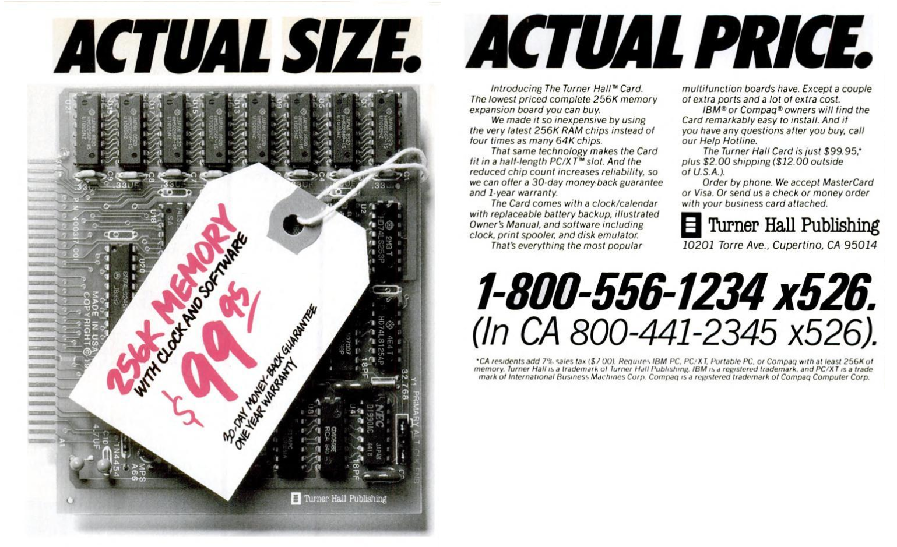
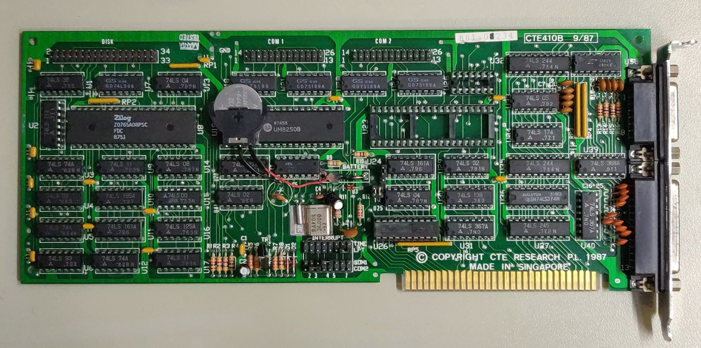

# Read/write realtime clock chip

## Supported Cards
- Turner Hall Publishing by Symantec
  - Memory expansion: 256K
  - RTC: NEC uPD1990AC @2c0h-2c2h
- CTE Research 410B (New for version 2.0)
  - Multi-function I/O card
  - RTC: NEC uPD4990AC @240h


### Turner Hall Publishing by Symantec


I couldn't find a driver for this RTC chip so I decoded the bus I/O port 
(see [PDF]( images/IO-bus-decode.pdf) 
and wrote my own program to read/write the clock.

The board is an 8-bit ISA memory expansion and RTC card from Turner Hall
Publishing.

This clock chip does not store the year! The program writes NECCLOCK.BIN 
in the current working directory to recover the year on the next reboot. 
It does handle a new year rollover that might occur while the machine is off. 
It also handles leap years. If the computer is not booted at least once a year, the
year it sets will be off by the number of years it hasn't been booted (less one).

### CTE Research 401B


User [siordon]( https://github.com/siordon ) was looking for a program to read/write
the RTC on this card and asked if NECCLOCK would work. It did not work because the 
I/O port address and registers are different. However, the chip is backwards
compatible so we reverse-engineered the card and added support for reading and writing
the RTC. Special thanks to siordon for all the hardware tracing and software testing!

This RTC does store the year and handles leap years so NECCLOCK.BIN is not created
or used.


## Assembly Instructions
The source is written to be assembled with Microsoft Assembler (MASM) and Linker (LINK).

```
C> MASM NECCLOCK
C> LINK NECCLOCK
```

## Usage
```
Usage: C> NECCLOCK <flags>

Card select flags:
/ct         Turner Hall Publishing 256KB memory expansion w/NEC uPD1990AC RTC
/cc         CTE Research CTE-410B multi-function I/O w/NEC uPD4990AC RTC

Function flags:
            Print RTC time
/s          Write RTC to DOS date/time
/i          Write DOS date/time to RTC

```

